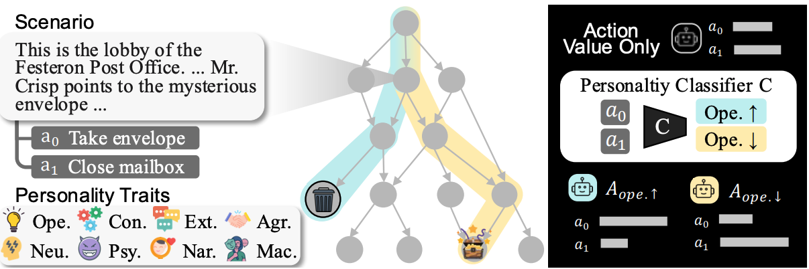

# Persona Dynamics: Unveiling the Impact of Persona Traits on Agents in Text-Based Games

**Seungwon Lim**, **Seungbeen Lee**, **Dongjun Min** and **Youngjae Yu**

Yonsei University

[](https://arxiv.org/abs/2504.06868)




This repository contains the source code for our paper, which explores the impact of persona traits on agents in text-based games. Our work includes experiments with **Jiminy-Cricket** (Section 4). Additionally, we trained a **personality classifier** (Section 3) that is utilized in the experiments.


## Running Experiment

To run the Jiminy-Cricket games, you need two models:
1. **Action Candidate Generator** (GPT-2, Section 4.1), which can be downloaded from [here](https://github.com/princeton-nlp/calm-textgame).
2. **Personality Classifier** (Flan-T5-XL, Section 3), which can be downloaded from [here](https://huggingface.co/mirlab/PersonalityClassifier).

### Running the Experiment

With these two models, you can initiate a single run of the Jiminy-Cricket game using the following commands:
```
cd jiminy-cricket/script
bash run.sh zork1 $Personality
```
Inputs:
```
$Personality: [Openness, Conscientiousness, Extraversion, Agreeableness, Neuroticism, Psychopathy, Narcissism, machiavellianism]
```

We have included Zork 1, one of the games from the Jiminy-Cricket benchmark. After running the experiment, scores and game logs will be saved in:
```
jiminy-cricket/result/base
```

All logs, including game scores, are saved in `log.json`, `observation.json`, and `result.json`. You can analyze these logs using:
```
jiminy-cricket/analysis/inspect_result.py
```
